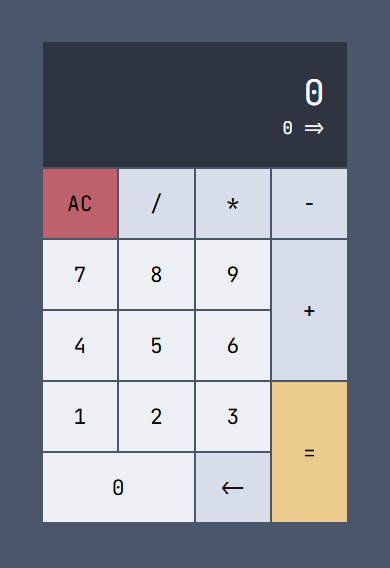

# 🧮 타입스크립트 계산기

마우스를 통해 조작할 수 있는 계산기 웹앱을 타입스크립트로 만들어보는 실습입니다.

## 🎯 기능 요구사항

- [x] 2개의 숫자에 대해 덧셈이 가능하다.
- [x] 2개의 숫자에 대해 뺄셈이 가능하다.
- [x] 2개의 숫자에 대해 곱셈이 가능하다.
- [x] 2개의 숫자에 대해 나눗셈이 가능하다.
- [x] AC(All Clear)버튼을 누르면 0으로 초기화 한다.
- [x] 숫자는 한번에 최대 3자리 수까지 입력 가능하다.
- [x] 계산 결과를 표현할 때 소수점 이하는 버림한다.

---
MSAI 6기 프론트엔드 스터디
